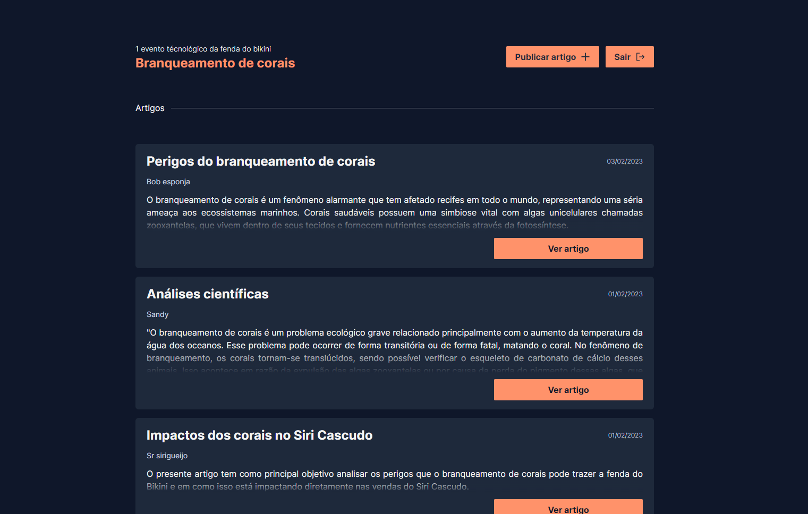
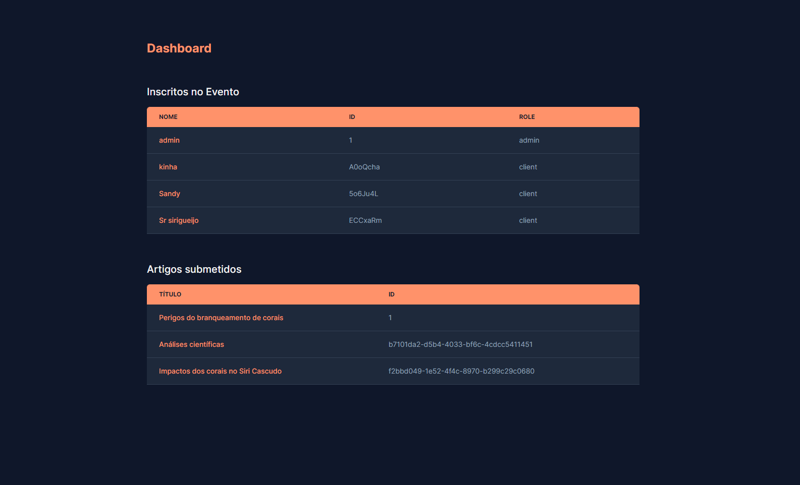

## Sobre o projeto
    Projeto feito com Nextjs 14, Tailwincss e Json-server para um site de um evento científico 
    fictício. Realizado para concluir o último desafio da trilha de Front-End do NADIC.

## Projeto

Tela inicial

Tela de cadastro

Tela de login

Tela de home

Tela de dashboard 
